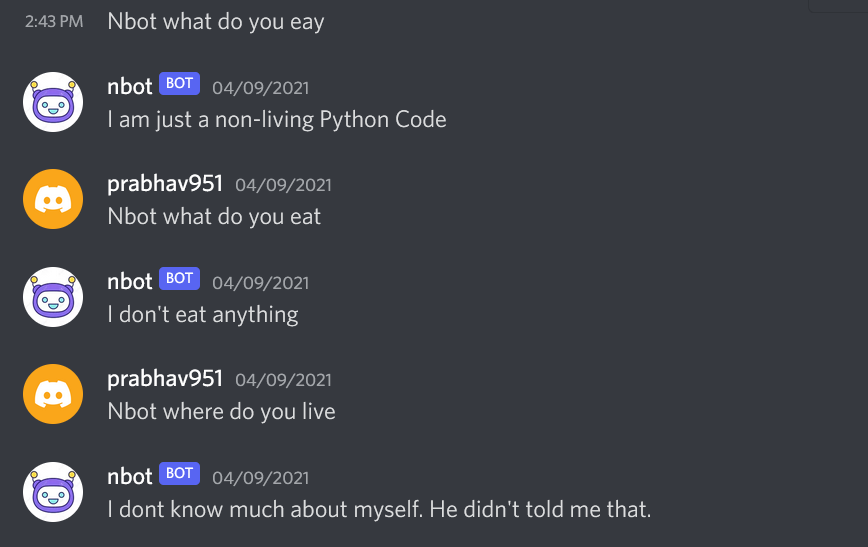
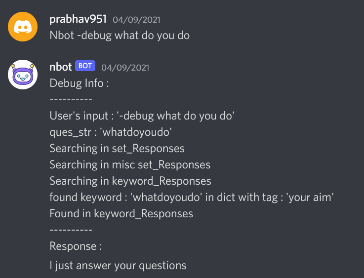

# nbot

A python chatbot for discord, based on pattern matching of predefined responses, saved in a file.

# !!! 
Code is not working currently. Will be updated soon.

# requirements 

To use this bot you need to have 
- A bot created on discord and get a bot token from discord.
- Add that bot to a discord server to chat with him.
- More details regarding discord and bots : https://www.freecodecamp.org/news/create-a-discord-bot-with-python/ 
- Python 3 installed 
- Python packages installed (listed in requirements.txt) 

# how to run 

- Make sure `botFiles` directory exist in the same folder where you run `bot.py`
- Run bot using `python bot.py` 
- Now chat with your bot using discord server 

# chatting instructions 
- nbot will listen to you if you begin your message with nbot
- use ` nbot <Questino> ` to ask anything. 
- use ` nbot -debug <Questoin> ` to see debug info.

# screenshots

